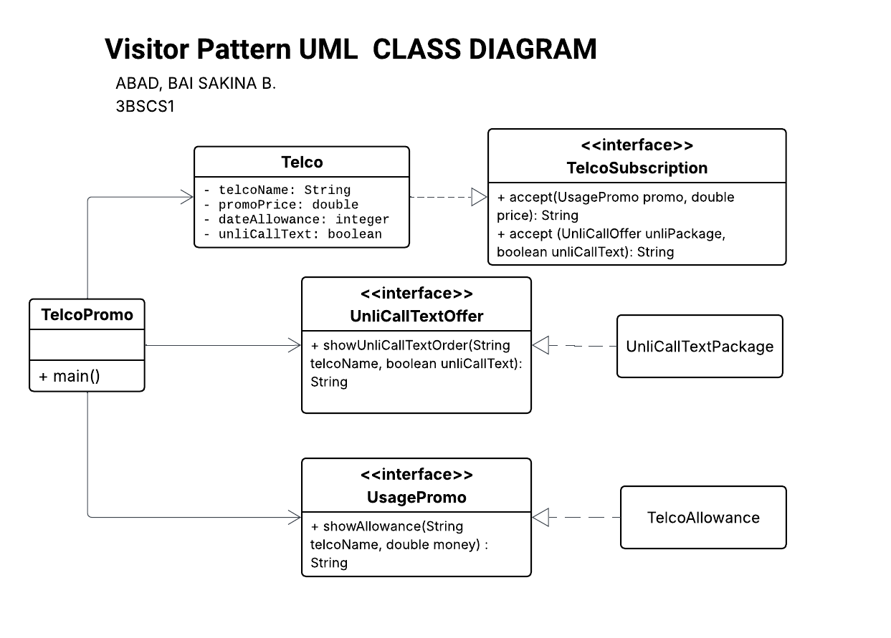

# ABAD_LAB-SW-3-Visitor-Pattern
A laboratory seatwork for Visitor Pattern design

This seatwork implements a mobile plan selection system for three major telecommunication providers (**Smart**, **Globe**, and **Ditto**) using the **Visitor Design Pattern**. The goal is to separate the telco subscription logic from the promotional offers being applied to them.

### Project Overview

The application simulates choosing a smartphone plan based on specific data, call, and text allowances:

| Provider | Data Allowance | Monthly Price | Call/Text Inclusion |
| --- | --- | --- | --- |
| **Smart** | 15 GB | ₱500 | None (Charged per use) |
| **Globe** | 10 GB | ₱450 | Unlimited (Within network only) |
| **Ditto** | 8 GB | ₱400 | Unlimited (To all networks) |

---

### Design Pattern: Visitor

By using the **Visitor Pattern**, we can add new promotional features (like `TelcoAllowance` or `UnliCallTextPackage`) without changing the existing `Telco` classes.

#### Key Components:

* **Element Interface (`TelcoSubscription`):** Defines how a telco accepts a visitor.
* **Concrete Element (`Telco`):** Represents the specific telco subscription details.
* **Visitor Interfaces (`UsagePromo`, `UnliCallOffer`):** Declares the visiting operations for the promos.
* **Concrete Visitors (`TelcoAllowance`, `UnliCallTextPackage`):** Implements the specific logic for displaying data and call/text offers.


#### The Visitor Logic

* **`TelcoAllowance`**: Returns a string showing the data allowance and price.
* **`UnliCallTextPackage`**: Returns a string indicating whether the plan includes unlimited calls and texts.


### Expected Output

```text
Smart Data Usage Offer and price: 15 GB for ₱500
Globe Data Usage Offer and price: 10 GB for ₱450
Ditto Data Usage Offer and price: 8 GB for ₱400
```

## UML DIAGRAM
